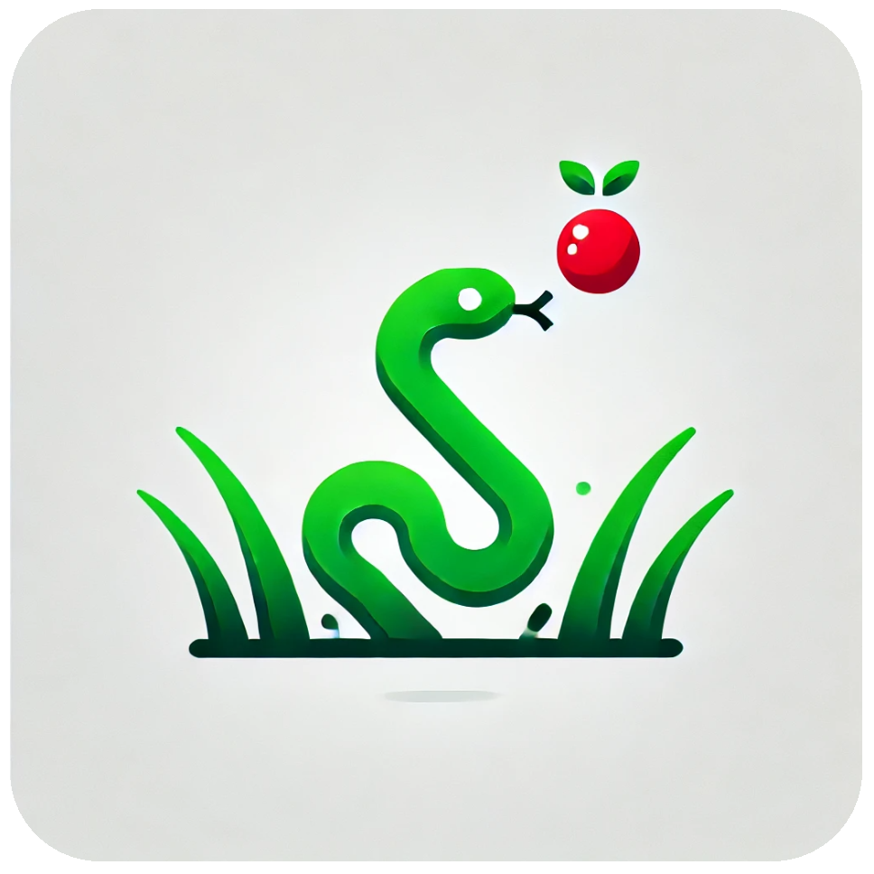

# 🐍 React Snake Game



A modern, responsive implementation of the classic Snake game built with React. Experience nostalgia with a fresh, contemporary twist!

## ✨ Features

- Smooth, responsive controls for an engaging gaming experience
- Real-time score tracking and high score persistence
- Modern, minimalist design with sleek animations
- Mobile-friendly with touch controls
- Customizable game speed and difficulty levels
- Collision detection and game-over scenarios
- Pause/Resume functionality
- Background grid for better visual guidance

## 🚀 Demo

[live demo link ](https://deepakpatil26.github.io/react-snake-game)


## 🛠️ Technologies Used

- React
- JavaScript/ES6+
- HTML5
- CSS3

## 📦 Installation

1. Clone the repository:
```bash
git clone https://github.com/deepakpatil2612/react-snake-game.git
```

2. Navigate to the project directory:
```bash
cd react-snake-game
```

3. Install dependencies:
```bash
npm install
```

4. Start the development server:
```bash
npm start
```

5. Open [http://localhost:3000](http://localhost:3000) to play the game in your browser.

## 🎮 How to Play

1. Use arrow keys (↑ ← ↓ →) to control the snake
2. Collect food items to grow longer and increase your score
3. Avoid hitting the walls or the snake's own body
4. Press Space to pause/resume the game
5. Try to achieve the highest score possible!

## 🔧 Game Controls

- **Arrow Keys/WASD**: Move snake
- **Space**: Pause/Resume game
- **Mobile**: Swipe gestures for movement

## 🎯 Future Enhancements

- [ ] Multiple food types with different effects
- [ ] Power-ups and special abilities
- [ ] Multiplayer mode
- [ ] Custom themes and skins
- [ ] Global leaderboard
- [ ] Sound effects and background music
- [ ] Achievement system

## 🤝 Contributing

Contributions are welcome! Please feel free to submit a Pull Request. For major changes, please open an issue first to discuss what you would like to change.

1. Fork the project
2. Create your feature branch (`git checkout -b feature/AmazingFeature`)
3. Commit your changes (`git commit -m 'Add some AmazingFeature'`)
4. Push to the branch (`git push origin feature/AmazingFeature`)
5. Open a Pull Request

## 📝 License

This project is licensed under the MIT License - see the [LICENSE.md](LICENSE.md) file for details.

## 👏 Acknowledgments

- Inspired by the classic Nokia Snake game
- Thanks to the React community for excellent documentation and resources
- Special thanks to [list any specific resources or people]

## 📧 Contact

Deepak Patil - [deepakpatil2612@gmail.com](mailto:deepakpatil2612@gmail.com)

Project Link: [https://github.com/deepakpatil26/react-snake-game](https://github.com/deepakpatil26/react-snake-game)

---

Made with ❤️ and React
